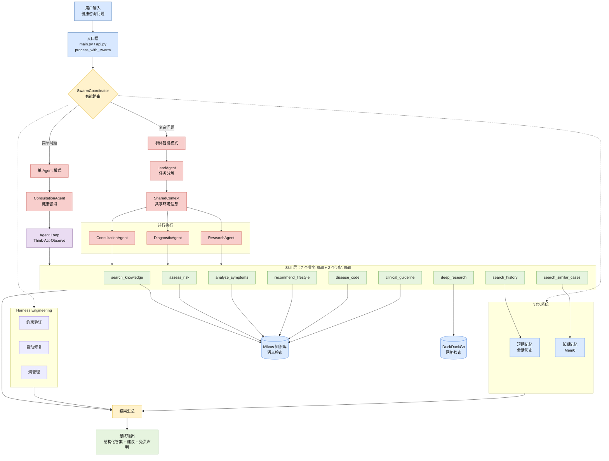

# 🩺 MedAgentCare

面向多轮医疗咨询场景的多 Agent 协作与安全问答系统。


MedAgentCare 围绕“多症状、多轮次、跨维度咨询”中的问题拆解不足、上下文遗忘和医疗安全边界不稳定，构建了“业务 Skill + 专业 Agent + Swarm 协作”的工程化问答链路。

> ⚠️ 说明：本项目仅用于学习、研究和工程展示，不能替代医生诊断或治疗。

## 🧭 项目概览

### 项目定位

在普通单 Agent 医疗问答中，模型容易把症状分析、知识检索、风险分级、生活建议和安全提示混在一次生成里处理，导致复杂问题拆解不稳定、多轮上下文丢失，以及高危症状提醒和免责声明遗漏。MedAgentCare 的核心目标是把医疗咨询拆成可复用、可约束、可验证的执行单元，并通过路由机制在简单问题和复杂问题之间切换执行路径。

### 核心方案

- **分层架构**：将知识检索、风险评估、症状分析、生活方式建议、ICD-10 编码、临床指南和深度研究拆成 7 个核心业务 Skill；同时补充会话历史检索和相似案例检索 2 个记忆类 Skill，仓库内共 9 个可自动发现和加载的 Skill。
- **专业 Agent**：上层由健康咨询、症状初筛、医学研究 3 类专业 Agent 负责不同咨询任务，复用底层 Skill，避免把所有能力硬塞进单个提示词。
- **执行调度**：基于 ReAct 思路实现 Think-Act-Observe Agent Loop；简单问题走单 Agent 快速通道，复杂问题由 LeadAgent 拆分后交给多个 Worker Agent 协作处理。
- **记忆机制**：短期记忆维护会话内最近 5 轮关键上下文；长期记忆基于本地 / Mem0 存储会话摘要，并支持跨会话相似案例检索。
- **安全约束**：通过约束配置和运行时校验限制医疗输出，覆盖免责声明、高危症状就医提醒、明确诊断禁止和具体处方剂量禁止；可自动修复缺少免责声明或高危提醒的输出。

### 架构图



### 结果指标

项目评估关注路由、记忆、响应耗时和医疗安全边界四类指标：

| 维度 | 优化前 | 优化后 |
| --- | ---: | ---: |
| 智能路由准确率 | - | 95% |
| 多轮上下文理解准确率 | 50% | 95% |
| 压缩后上下文冗余 | - | 降低约 35% |
| 单 Agent 响应耗时 | 30 秒 | 20-30 秒 |
| Swarm 模式响应耗时 | 120-200秒 | 50-80 秒 |
| 医学盲评综合得分 | 3.8 / 5 | 4.5 / 5 |

### 技术栈

| 层级 | 技术 |
| --- | --- |
| 后端服务 | Python, FastAPI |
| 前端演示 | React, TypeScript, Vite |
| Agent 编排 | ReAct, Agent Swarm, Skill Registry |
| 记忆与知识库 | Mem0, Milvus Lite, 本地 MarkDown文件 |
| 安全约束 | YAML constraints, runtime validator, auto fixer |
| 工程化 | uv, Docker, unittest |

## 📁 目录结构

```text
.
├── pyproject.toml                 # 包元数据和命令入口
├── Dockerfile                     # Docker 部署入口
├── .env.example                   # 环境变量示例
├── src/medagentcare/
│   ├── api.py                     # FastAPI HTTP 入口
│   ├── main.py                    # 交互式 CLI 入口
│   ├── config.py                  # 环境变量驱动的运行配置
│   ├── agents/                    # 三类 Worker Agent
│   ├── core/                      # LLM、Agent Loop、Skill 注册/加载
│   ├── swarm/                     # Swarm 路由与共享上下文
│   ├── memory/                    # 短期/长期记忆与会话总结
│   ├── knowledge/                 # Milvus Lite 知识库封装和导入脚本
│   ├── research/                  # DeepResearch 工作流和证据综合
│   ├── constraints/               # Agent/Swarm 约束配置
│   └── validation/                # 输出验证和自动修复模块
└── frontend/                      # 前端演示页
```

## ⚙️ 配置

配置统一从环境变量读取。

```bash
cp .env.example .env
```

<details>
<summary>关键环境变量</summary>

```bash
LLM_API_KEY=your-openai-compatible-api-key
LLM_MODEL_NAME="qwen3.6-plus"
LLM_BASE_URL="https://dashscope.aliyuncs.com/compatible-mode/v1"
LLM_TEMPERATURE=0.7
LLM_MAX_TOKENS=8192

# 可选：启用 Mem0 长期记忆
MEM0_API_KEY=

# 可选：Hugging Face 镜像和模型缓存
HF_ENDPOINT=https://hf-mirror.com
HF_HOME=/Users/your-name/.cache/huggingface
SENTENCE_TRANSFORMERS_HOME=/Users/your-name/.cache/sentence-transformers
TORCH_HOME=/Users/your-name/.cache/torch
```

</details>

## 🚀 本地运行

```bash
uv sync
```

启动 CLI：

```bash
uv run medagentcare
```

启动 FastAPI：

```bash
uv run uvicorn medagentcare.api:app --host 0.0.0.0 --port 8000
```

启动前端演示页：

```bash
cd frontend
npm install
npm run dev
```

前端默认为 `http://127.0.0.1:5173`。

### Docker Compose 一键启动

本地有 Docker Desktop 或 Docker Engine + Compose Plugin 时，可以直接启动 FastAPI 后端和 Vite 前端：

```bash
docker compose up -d
```

默认访问地址：

- 前端：`http://localhost:5173`
- 后端健康检查：`http://localhost:8000/health`
- 后端流式咨询接口：`http://localhost:8000/chat/stream`

Compose 会把 Milvus Lite 数据库和模型缓存挂载到 Docker volume `/data` 下。容
健康检查：

```bash
curl http://127.0.0.1:8000/health
```

流式咨询接口：

```bash
curl -N -X POST http://127.0.0.1:8000/chat/stream \
  -H "Accept: text/event-stream" \
  -H "Content-Type: application/json" \
  -d '{
    "question": "我最近头痛和发热，应该怎么办？"
  }'
```

## 🔌 API 接入

### 健康检查

> 浏览器打开以查看： 

> http://127.0.0.1:8000/docs 

> http://127.0.0.1:8000/redoc

请求：

```bash
curl http://127.0.0.1:8000/health
```

响应示例：

```json
{
  "status": "ok",
  "service": "medagentcare",
  "llm_configured": true,
  "mem0_configured": true
}
```

字段说明：

- `status`：服务进程是否可响应请求。
- `service`：服务名。
- `llm_configured`：是否检测到 `LLM_API_KEY`。
- `mem0_configured`：是否检测到 `MEM0_API_KEY`。

### 流式医疗咨询

请求：

```bash
curl -N -X POST "http://127.0.0.1:8000/chat/stream" \
  -H "Content-Type: application/json" \
  -H "Accept: text/event-stream" \
  -d '{
    "question": "我最近胸闷气短，活动后更明显，怎么办？",
    "context": {
      "age": 55,
      "history": "高血压"
    },
    "enable_swarm": true,
    "session_id": "demo-session-001",
    "memory": {
      "enabled": true,
      "backend": "local"
    }
  }'
```

## 📚 知识库

医学文档位于 `src/medagentcare/knowledge/data/documents/`，这些 txt 文件是版本化源数据。导入 Milvus Lite：

```bash
uv run medagentcare-import-knowledge
```

`src/medagentcare/knowledge/data/*.db` 按当前策略视为本地生成产物，默认不纳入 Git，也不会进入 Docker build context。部署时需要在环境初始化阶段运行导入脚本，或通过 volume 挂载预生成的数据库。详见 `src/medagentcare/knowledge/data/README.md`。

## 🧪 验证状态

离线回归测试命令：

```bash
uv run python -m unittest discover -s tests
```

该命令覆盖运行配置读取、FastAPI `/health`、Skill 发现、医疗安全约束，以及 `/chat`、`/chat/stream` 在 mock Swarm 下的错误边界和 `enable_swarm=False` 参数传递。

基础编译检查命令：

```bash
uv run python -m compileall -q src tests .agents/skills
```