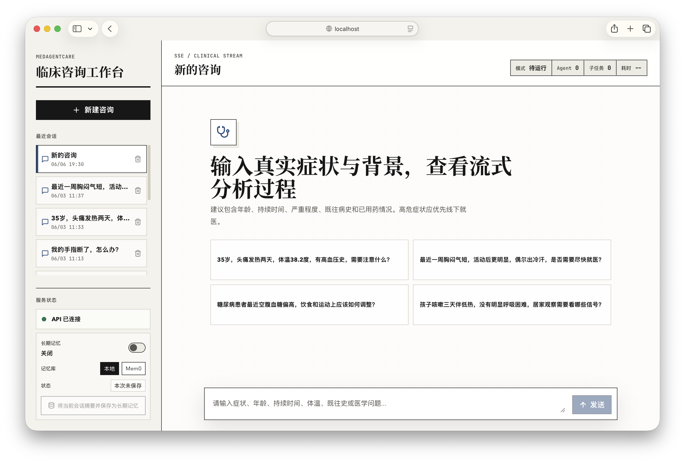
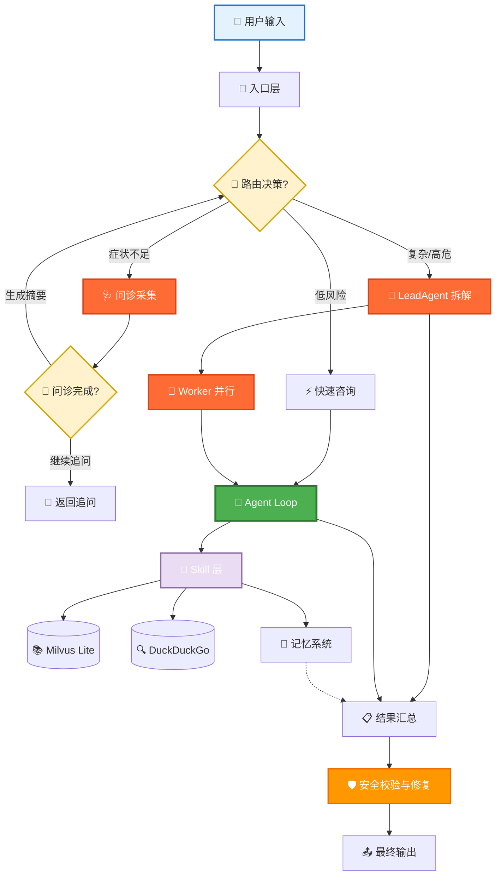

<div align="center">

# 🩺 MedAgentCare
### Multi-Agent Medical Consultation System with Streaming Safety Guardrails

<p align="center">
  
  
  
  
  
</p>

---

面向多症状、多轮次、信息不完整的医疗咨询场景，构建"问诊信息采集 + 业务 Skill + 专业 Agent + Swarm 协作"的安全问答链路。

</div>

> [!WARNING]
> 本项目仅用于学习、研究和工程展示，不能替代医生诊断或治疗。涉及胸痛、呼吸困难、意识异常、严重过敏、急性神经功能缺损等高危症状时，应及时就医或联系当地急救服务。

<p align="center">
  
</p>

## 🌟 核心特性

<div align="center">

<table>
<tr>
<td width="25%" align="center">
<b>🩺 多轮问诊采集</b><br/>
症状背景不足时先追问
</td>
<td width="25%" align="center">
<b>🧭 三路智能路由</b><br/>
问诊、快路径、Swarm 协作
</td>
<td width="25%" align="center">
<b>🧩 9 个可发现 Skill</b><br/>
检索、评估、研究与记忆
</td>
<td width="25%" align="center">
<b>🛡️ 医疗安全约束</b><br/>
校验、修复与免责声明
</td>
</tr>
</table>

</div>

- **问诊信息采集**：`InterviewAgent` 维护症状报告状态，在关键信息不足时逐轮追问，并在信息完整后生成问诊摘要。
- **快速咨询路径**：常见、低风险、无需复杂拆解的问题可直接进入 `ConsultationAgent`，降低响应成本。
- **Swarm 协作路径**：复杂、高危、诊断或研究类问题由 `LeadAgent` 拆解任务，再交给 `ConsultationAgent`、`DiagnosticAgent`、`ResearchAgent` 并行处理。
- **记忆机制**：短期记忆维护会话内上下文；长期记忆支持 Mem0，也提供本地文件后端用于跨会话健康记忆和相似案例检索。
- **安全输出边界**：通过 YAML 约束、运行时校验和自动修复，覆盖明确诊断、处方剂量、高危症状提醒和免责声明等风险点。

## 🏗️ 系统架构



## 📊 指标与验证

项目评估关注路由、记忆、响应成本和医疗安全边界四类指标。

<div align="center">

| 维度 | 优化前 | 优化后 |
| --- | ---: | ---: |
| 智能路由准确率 | - | 95% |
| 常见咨询延迟成本 | Swarm 基线 | 降低约 75% |
| 多轮上下文理解准确率 | 60% | 92% |
| 医学盲评综合得分 | 3.8 / 5 | 4.5 / 5 |

</div>

评测方式包括自建多轮医疗咨询样例集、LLM-as-a-Judge 和人工抽检，重点观察信息不足场景下回答完整性、风险识别稳定性、免责声明覆盖和高危症状就医提醒。

## 🛠️ 技术栈

<div align="center">

| 层级 | 技术 |
| --- | --- |
| 后端服务 | Python, FastAPI, Pydantic |
| 前端演示 | React, TypeScript, Vite |
| Agent 编排 | Think-Act-Observe, Agent Swarm, Skill Registry |
| 记忆与知识库 | Mem0, Milvus Lite, 本地文件记忆 |
| 安全约束 | YAML constraints, runtime validator, auto fixer |
| 工程化 | uv, Docker Compose, unittest |

</div>

## 🚀 快速开始

### 📦 安装后端依赖

```bash
uv sync
```

### 🔑 配置环境变量

```bash
cp .env.example .env
```

<details>
<summary><b>关键环境变量</b></summary>

```bash
LLM_API_KEY=your-openai-compatible-api-key
LLM_MODEL_NAME="qwen3.6-plus"
LLM_BASE_URL="https://dashscope.aliyuncs.com/compatible-mode/v1"
LLM_TEMPERATURE=0.7
LLM_MAX_TOKENS=8192

# 可选：启用 Mem0 长期记忆
MEM0_API_KEY=

# 可选：Hugging Face 镜像和模型缓存
HF_ENDPOINT=https://hf-mirror.com
HF_HOME=/Users/your-name/.cache/huggingface
SENTENCE_TRANSFORMERS_HOME=/Users/your-name/.cache/sentence-transformers
TORCH_HOME=/Users/your-name/.cache/torch
```

</details>

### ⚡ 启动 FastAPI 后端

```bash
uv run uvicorn medagentcare.api:app --host 0.0.0.0 --port 8000
```

服务启动后可访问：

- API 文档：`http://127.0.0.1:8000/docs`
- ReDoc 文档：`http://127.0.0.1:8000/redoc`
- 健康检查：`http://127.0.0.1:8000/health`

### 🖥️ 启动前端演示页

```bash
cd frontend
npm ci
npm run dev
```

前端默认访问地址为 `http://127.0.0.1:5173`，默认调用 `VITE_API_BASE_URL` 指向的后端。

### 💬 启动 CLI

```bash
uv run medagentcare
```

## 🐳 Docker Compose

本地有 Docker Desktop 或 Docker Engine + Compose Plugin 时，可以一键启动 FastAPI 后端和 Vite 前端：

```bash
docker compose up -d
```

默认访问地址：

- 前端：`http://localhost:5173`
- 后端健康检查：`http://localhost:8000/health`
- 后端流式咨询接口：`http://localhost:8000/chat/stream`

Compose 会把 Milvus Lite 数据库、会话数据、长期记忆和模型缓存挂载到 `/data` 与本地 `.medagentcare/` 目录下。

常用运维命令：

```bash
docker compose config --quiet
docker compose logs -f api
docker compose logs -f frontend
docker compose down
```

## 🔌 API 接入

### ✅ 健康检查

```bash
curl http://127.0.0.1:8000/health
```

响应示例：

```json
{
  "status": "ok",
  "service": "medagentcare",
  "llm_configured": true,
  "mem0_configured": true,
  "langsmith_tracing": false,
  "langsmith_configured": false,
  "langsmith_enabled": false,
  "langsmith_project": "medagentcare",
  "memory_enabled": true,
  "memory_default_backend": "local"
}
```

`/health` 只表示 API 进程和基础配置可检查，不代表真实 LLM、Mem0、Milvus Lite 或外网搜索链路一定可用。

### 🌊 流式医疗咨询

前端默认使用 `/chat/stream`。该接口返回 Server-Sent Events，不应按普通 JSON 响应处理。

```bash
curl -N -X POST "http://127.0.0.1:8000/chat/stream" \
  -H "Content-Type: application/json" \
  -H "Accept: text/event-stream" \
  -d '{
    "question": "我最近胸闷气短，活动后更明显，怎么办？",
    "context": {
      "age": 55,
      "history": "高血压"
    },
    "enable_swarm": true,
    "session_id": "demo-session-001",
    "memory": {
      "enabled": true,
      "backend": "local"
    }
  }'
```

SSE 事件包括 `start`、`progress`、`stream_delta`、`heartbeat`、`result`、`done`、`error`。代理或网关部署时要避免响应体缓冲，并给 LLM、检索和外网搜索链路留足超时。

### 🔍 LangSmith 链路追踪

本项目可选接入 LangSmith，用于查看一次咨询中的 FastAPI 请求、Swarm 路由、Agent Loop、Skill 调用和 OpenAI-compatible LLM 调用。默认关闭。

```bash
LANGSMITH_TRACING=true
LANGSMITH_API_KEY=your-langsmith-api-key
LANGSMITH_PROJECT=medagentcare
uv run uvicorn medagentcare.api:app --host 0.0.0.0 --port 8000
```

Docker Compose 启动时同样读取这些变量：

```bash
LANGSMITH_TRACING=true LANGSMITH_API_KEY=your-langsmith-api-key docker compose up -d
```

启用后，`/chat` 和 `/chat/stream` 的后端执行链路会写入 LangSmith；项目内 SSE `progress` 事件仍用于前端实时展示。

## 📚 知识库

医学文档位于 `src/medagentcare/knowledge/data/documents/`，这些 txt 文件是版本化源数据。导入 Milvus Lite：

```bash
uv run medagentcare-import-knowledge
```

`src/medagentcare/knowledge/data/*.db` 是本地生成产物，默认不纳入 Git，也不会进入 Docker build context。部署时需要在环境初始化阶段运行导入脚本，或通过 volume 挂载预生成的数据库。详见 `src/medagentcare/knowledge/data/README.md`。

## 📁 项目结构

```text
.
├── pyproject.toml                 # 包元数据和命令入口
├── Dockerfile                     # Docker 部署入口
├── compose.yaml                   # 后端 + 前端 Compose 编排
├── .env.example                   # 环境变量示例
├── src/medagentcare/
│   ├── api.py                     # FastAPI HTTP 入口
│   ├── main.py                    # 交互式 CLI 入口
│   ├── config.py                  # 环境变量驱动的运行配置
│   ├── agents/                    # 三类 Worker Agent
│   ├── core/                      # LLM、Agent Loop、Skill 注册/加载
│   ├── swarm/                     # Swarm 路由与共享上下文
│   ├── memory/                    # 短期/长期记忆与会话总结
│   ├── knowledge/                 # Milvus Lite 知识库封装和导入脚本
│   ├── research/                  # DeepResearch 工作流和证据综合
│   ├── constraints/               # Agent/Swarm 约束配置
│   └── validation/                # 输出验证和自动修复模块
├── frontend/                      # React + Vite 前端演示页
└── tests/                         # 离线单元/集成替身测试
```

## 🧪 验证命令

离线回归测试：

```bash
uv run python -m unittest discover -s tests
```

该命令覆盖运行配置读取、FastAPI `/health`、Skill 发现、医疗安全约束，以及 `/chat`、`/chat/stream` 在 mock Swarm 下的错误边界和 `enable_swarm=False` 参数传递。

基础编译检查：

```bash
uv run python -m compileall -q src tests .agents/skills
```

前端构建检查：

```bash
cd frontend
npm run build
```

Docker Compose 配置检查：

```bash
docker compose config --quiet
```
