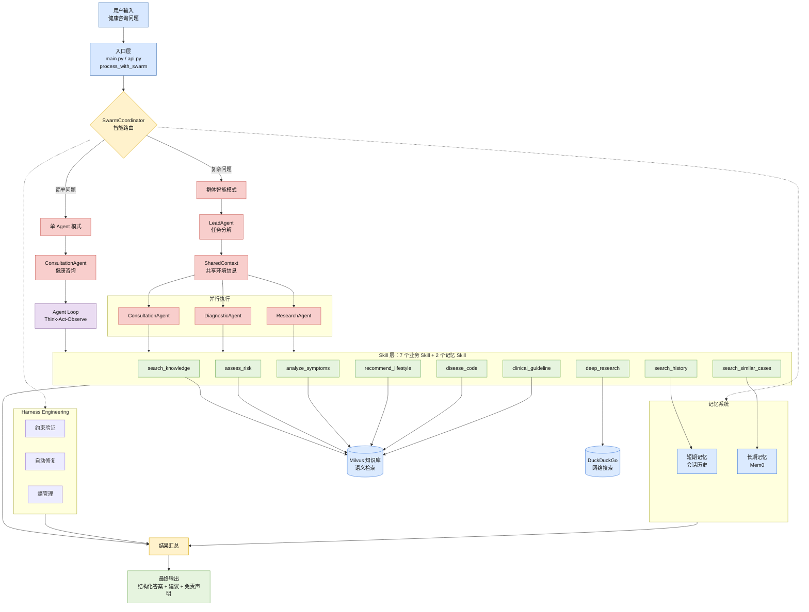

# 🩺 MedAgentCare

面向多轮医疗咨询场景的多 Agent 协作与安全问答系统。


MedAgentCare 围绕“多症状、多轮次、跨维度咨询”中的问题拆解不足、上下文遗忘和医疗安全边界不稳定，构建了“原子 Skill + 专业 Agent + Swarm 协作”的工程化问答链路。

> ⚠️ 说明：本项目仅用于学习、研究和工程展示，不能替代医生诊断或治疗。

## 🧭 项目概览

### 项目定位

在普通单 Agent 医疗问答中，模型容易把症状分析、知识检索、风险分级、生活建议和安全提示混在一次生成里处理，导致复杂问题拆解不稳定、多轮上下文丢失，以及高危症状提醒和免责声明遗漏。MedAgentCare 的核心目标是把医疗咨询拆成可复用、可约束、可验证的执行单元，并通过路由机制在简单问题和复杂问题之间切换执行路径。

### 核心方案

- **分层架构**：将知识检索、风险评估、症状分析、生活方式建议、ICD-10 编码、临床指南和深度研究拆成 7 个核心业务 Skill；同时补充会话历史检索和相似案例检索 2 个记忆类 Skill，仓库内共 9 个可自动发现和加载的 Skill。
- **专业 Agent**：上层由健康咨询、症状初筛、医学研究 3 类专业 Agent 负责不同咨询任务，复用底层 Skill，避免把所有能力硬塞进单个提示词。
- **执行调度**：基于 ReAct 思路实现 Think-Act-Observe Agent Loop；简单问题走单 Agent 快速通道，复杂问题由 LeadAgent 拆分后交给多个 Worker Agent 协作处理。
- **记忆机制**：短期记忆维护会话内最近 5 轮关键上下文；长期记忆基于 Mem0 存储会话摘要，并支持跨会话相似案例检索。
- **安全约束**：通过约束配置和运行时校验限制医疗输出，覆盖免责声明、高危症状就医提醒、明确诊断禁止和具体处方剂量禁止；可自动修复缺少免责声明或高危提醒的输出。

### 架构图



### 结果指标

项目评估关注路由、记忆、响应耗时和医疗安全边界四类指标：

| 维度 | 优化前 | 优化后 |
| --- | ---: | ---: |
| 智能路由准确率 | 88% | 95% |
| 多轮上下文理解准确率 | 60% | 92% |
| 压缩后上下文冗余 | - | 降低约 35% |
| 单 Agent 响应耗时 | 40-45 秒 | 5-15 秒 |
| Swarm 模式响应耗时 | - | 20-30 秒 |
| 医学盲评综合得分 | - | 4.5 / 5 |

### 技术栈

| 层级 | 技术 |
| --- | --- |
| 后端服务 | Python, FastAPI |
| 前端演示 | React, TypeScript, Vite |
| Agent 编排 | ReAct, Agent Swarm, Skill Registry |
| 记忆与知识库 | Mem0, Milvus Lite |
| 安全约束 | YAML constraints, runtime validator, auto fixer |
| 工程化 | uv, Docker, unittest |

## ✅ 当前可验证状态

代码中可检查的模块：

- `src/medagentcare/main.py`：交互式命令行入口。
- `src/medagentcare/api.py`：FastAPI 入口，提供 `/health`、`/chat` 和 `/chat/stream`。
- `src/medagentcare/swarm/`：LeadAgent、SwarmCoordinator、SharedContext 等多 Agent 协作骨架。
- `src/medagentcare/agents/`：ConsultationAgent、DiagnosticAgent、ResearchAgent 三类 Worker Agent。
- `src/medagentcare/core/`：LLM 客户端、Agent Loop、SkillRegistry、SkillLoader。
- `src/medagentcare/memory/`：短期记忆、Mem0 长期记忆、会话总结和熵管理模块。
- `src/medagentcare/knowledge/`：Milvus Lite 知识库封装和 txt 文档导入脚本。
- `.agents/skills/`：9 个 Skill 的 `SKILL.md` 元数据和可加载 `script/*.py` 实现。
- `Dockerfile` / `compose.yaml` / `.dockerignore` / `.env.example`：容器部署基础文件。
- `frontend/`：Vite + React + TypeScript 前端演示页，调用 FastAPI `/health` 和 `/chat/stream`。

运行限制：

- 医疗知识库、LLM、Mem0、网络搜索依赖本地环境或外部服务，部署前必须显式配置。

## 📁 目录结构

```text
.
├── pyproject.toml                 # 包元数据和命令入口
├── Dockerfile                     # Docker 部署入口
├── .env.example                   # 环境变量示例
├── src/medagentcare/
│   ├── api.py                     # FastAPI HTTP 入口
│   ├── main.py                    # 交互式 CLI 入口
│   ├── config.py                  # 环境变量驱动的运行配置
│   ├── agents/                    # 三类 Worker Agent
│   ├── core/                      # LLM、Agent Loop、Skill 注册/加载
│   ├── swarm/                     # Swarm 路由与共享上下文
│   ├── memory/                    # 短期/长期记忆与会话总结
│   ├── knowledge/                 # Milvus Lite 知识库封装和导入脚本
│   ├── research/                  # DeepResearch 工作流和证据综合
│   ├── constraints/               # Agent/Swarm 约束配置
│   └── validation/                # 输出验证和自动修复模块
└── frontend/                      # 前端演示页
```

## ⚙️ 配置

配置统一从环境变量读取，不再依赖固定本机路径。

```bash
cp .env.example .env
```

<details>
<summary>关键环境变量</summary>

```bash
LLM_API_KEY=your-openai-compatible-api-key
LLM_MODEL_NAME="qwen3.6-plus"
LLM_BASE_URL="https://dashscope.aliyuncs.com/compatible-mode/v1"
LLM_TEMPERATURE=0.7
LLM_MAX_TOKENS=8192

# 可选：启用 Mem0 长期记忆
MEM0_API_KEY=

# 可选：Hugging Face 镜像和模型缓存
HF_ENDPOINT=https://hf-mirror.com
HF_HOME=/Users/your-name/.cache/huggingface
SENTENCE_TRANSFORMERS_HOME=/Users/your-name/.cache/sentence-transformers
TORCH_HOME=/Users/your-name/.cache/torch
```

本地 MacBook Air 演示建议把 Hugging Face、Sentence Transformers 和 Torch 缓存放在用户目录下，不建议使用相对路径，避免从不同工作目录启动服务时重复下载模型。

</details>

## 🚀 本地运行

```bash
uv sync
```

启动 CLI：

```bash
uv run medagentcare
```

启动 FastAPI：

```bash
uv run uvicorn medagentcare.api:app --host 0.0.0.0 --port 8000
```

启动前端演示页：

```bash
cd frontend
npm install
npm run dev
```

前端默认请求 `http://127.0.0.1:8000`。如需改为其他后端地址：

```bash
VITE_API_BASE_URL=http://127.0.0.1:8000 npm run dev
```

API 默认允许 Vite 常见开发端口跨域访问，包括 `http://localhost:5173`、`http://127.0.0.1:5173`、`http://localhost:4173` 和 `http://127.0.0.1:4173`。部署到不同域名时，可以用逗号分隔设置允许来源：

```bash
MEDAGENTCARE_CORS_ORIGINS=https://app.example.com,https://admin.example.com
```

开发调试也可以临时设置 `MEDAGENTCARE_CORS_ORIGINS=*`，生产环境不建议这样配置。

### Docker Compose 一键启动

本地有 Docker Desktop 或 Docker Engine + Compose Plugin 时，可以直接启动 FastAPI 后端和 Vite 前端：

```bash
docker compose up -d
```

默认访问地址：

- 前端：`http://localhost:5173`
- 后端健康检查：`http://localhost:8000/health`
- 后端流式咨询接口：`http://localhost:8000/chat/stream`

Compose 会读取项目根目录 `.env` 参与变量替换；如果没有 `.env`，容器仍会启动，但 `/health` 会显示 `llm_configured: false`，真实提问会因为缺少 LLM 密钥而失败。最小可用配置：

```bash
cp .env.example .env
```

然后在 `.env` 中至少设置：

```bash
LLM_API_KEY=...
LLM_BASE_URL="https://dashscope.aliyuncs.com/compatible-mode/v1"
LLM_MODEL_NAME="qwen3.6-plus"
```

前端运行在浏览器里，所以 `VITE_API_BASE_URL` 必须是浏览器可访问的后端地址，默认是 `http://localhost:8000`，不能写成 Docker 内部服务名 `http://api:8000`。如果改了后端宿主机端口，需要同步设置：

```bash
MEDAGENTCARE_API_PORT=18000
VITE_API_BASE_URL=http://localhost:18000
```

默认 CORS 允许 `http://localhost:5173` 和 `http://127.0.0.1:5173`。如果改了前端端口或域名，需要同步设置：

```bash
MEDAGENTCARE_FRONTEND_PORT=15173
MEDAGENTCARE_CORS_ORIGINS=http://localhost:15173,http://127.0.0.1:15173
```

Compose 会把 Milvus Lite 数据库和模型缓存挂载到 Docker volume `/data` 下。容器内路径使用 Docker 专用变量，默认值为：

```bash
MEDAGENTCARE_DOCKER_MILVUS_DB_PATH=/data/knowledge/milvus_lite.db
MEDAGENTCARE_DOCKER_HF_HOME=/data/model-cache/huggingface
MEDAGENTCARE_DOCKER_SENTENCE_TRANSFORMERS_HOME=/data/model-cache/sentence-transformers
MEDAGENTCARE_DOCKER_TORCH_HOME=/data/model-cache/torch
```

这些 Docker 专用变量会映射成容器内实际使用的 `MEDAGENTCARE_MILVUS_DB_PATH`、`HF_HOME`、`SENTENCE_TRANSFORMERS_HOME` 和 `TORCH_HOME`。不要把本机绝对路径如 `/Users/.../.cache/huggingface` 直接传进容器；如需启用 Mem0 长期记忆，额外设置 `MEM0_API_KEY`。

本地启动时，应用会自动读取项目根目录 `.env`。如果同名变量已经存在于进程环境中，真实环境变量优先，不会被 `.env` 覆盖。

非交互式 zsh 不会自动读取 `~/.zshrc`。如果需要使用 shell 中的临时变量覆盖 `.env`，可以在启动前显式导出：

```bash
export HF_ENDPOINT=https://hf-mirror.com
uv run uvicorn medagentcare.api:app --host 0.0.0.0 --port 8000
```

健康检查：

```bash
curl http://127.0.0.1:8000/health
```

流式咨询接口：

```bash
curl -N -X POST http://127.0.0.1:8000/chat/stream \
  -H "Accept: text/event-stream" \
  -H "Content-Type: application/json" \
  -d '{
    "question": "我最近头痛和发热，应该怎么办？",
    "context": {"age": 35},
    "enable_swarm": true
  }'
```

## 🔌 API 接入

### 健康检查

请求：

```bash
curl http://127.0.0.1:8000/health
```

响应示例：

```json
{
  "status": "ok",
  "service": "medagentcare",
  "llm_configured": true,
  "mem0_configured": false
}
```

字段说明：

- `status`：服务进程是否可响应请求。
- `service`：服务名。
- `llm_configured`：是否检测到 `LLM_API_KEY`。
- `mem0_configured`：是否检测到 `MEM0_API_KEY`。

`/health` 只表示 API 进程和基础配置状态，不代表 `/chat/stream` 已完成真实 LLM、Mem0、Milvus Lite 或网络搜索调用验证。

### 流式医疗咨询

请求：

```bash
curl -N -X POST http://127.0.0.1:8000/chat/stream \
  -H "Accept: text/event-stream" \
  -H "Content-Type: application/json" \
  -d '{
    "question": "我最近头痛和发热，应该怎么办？",
    "context": {
      "age": 35,
      "duration": "2 days",
      "temperature_celsius": 38.2
    },
    "enable_swarm": true,
    "session_id": "demo-session-001"
  }'
```

请求字段：

- `question`：必填，用户的医疗或健康问题，不能为空字符串。
- `context`：可选，结构化上下文，例如年龄、症状持续时间、既往史等。
- `enable_swarm`：可选，默认 `true`，控制是否启用多 Agent 路由。
- `session_id`：可选，会话标识，用于前端或上游系统关联多轮请求。

`/chat/stream` 返回 `text/event-stream`，用于在长时间 LLM、Mem0、Milvus Lite 或网络搜索执行期间持续推送用户可见进度。当前事件类型：

- `start`：SSE 连接已建立，包含 `session_id` 和 `enable_swarm`。
- `progress`：后端关键执行节点，数据包含 `timestamp`、`stage`、`title`、`detail`、`status` 和 `metadata`。
- `heartbeat`：后端仍在执行，用于保持连接活跃。
- `result`：最终咨询结果，结构由 `process_with_swarm(...)` 返回。
- `done`：流式响应正常结束。
- `error`：业务或运行时错误，数据包含 `status_code` 和 `detail`。

示例响应片段：

```text
event: start
data: {"session_id":"demo-session-001","enable_swarm":true}

event: progress
data: {"timestamp":"2026-05-23T10:00:00","stage":"lead_assessment","title":"分析问题复杂度","detail":"判断是否需要多 Agent 协作。","status":"running","metadata":{}}

event: result
data: {"answer":"...","swarm_enabled":true}

event: done
data: {"ok":true}
```

前端接入时应按 SSE 事件逐步处理，不要把 `/chat/stream` 当成普通 JSON 响应。`/chat` 仍保留同步 JSON 兼容入口，但当前前端演示页不使用它。

### 错误响应

请求体缺少必填字段或字段类型不匹配时，FastAPI 会在建立 SSE 之前返回普通 HTTP `422`：

```json
{
  "detail": [
    {
      "type": "missing",
      "loc": ["body", "question"],
      "msg": "Field required",
      "input": {
        "context": {}
      }
    }
  ]
}
```

如果请求已经进入 `/chat/stream` 处理流程，业务参数错误会以 SSE `error` 事件返回：

```text
event: error
data: {"status_code":400,"detail":"invalid request"}
```

Swarm 流程、LLM 调用、记忆模块或知识库调用失败时也会以 SSE `error` 事件返回：

```text
event: error
data: {"status_code":500,"detail":"consultation failed: upstream service error"}
```

如果客户端收到非 `2xx` HTTP 状态，说明请求尚未进入正常 SSE 事件流，应按普通 HTTP 错误处理；如果 HTTP 状态为 `2xx` 但流中出现 `event: error`，应读取事件里的 `detail` 展示失败原因。

### 前端接入示例

```js
const controller = new AbortController();

try {
  const response = await fetch("http://127.0.0.1:8000/chat/stream", {
    method: "POST",
    headers: {
      "Content-Type": "application/json",
    },
    body: JSON.stringify({
      question: userQuestion,
      context: {
        age: 35,
      },
      enable_swarm: true,
      session_id: currentSessionId,
    }),
    signal: controller.signal,
  });

  if (!response.ok) {
    throw new Error(`request failed: ${response.status}`);
  }
  if (!response.body) {
    throw new Error("stream response body is empty");
  }

  const reader = response.body.getReader();
  const decoder = new TextDecoder();
  let buffer = "";

  while (true) {
    const { done, value } = await reader.read();
    if (done) break;

    buffer += decoder.decode(value, { stream: true });
    const frames = buffer.split("\n\n");
    buffer = frames.pop() || "";

    for (const frame of frames) {
      const event = frame.match(/^event: (.+)$/m)?.[1];
      const dataLine = frame.match(/^data: (.+)$/m)?.[1];
      const data = dataLine ? JSON.parse(dataLine) : {};

      if (event === "progress") {
        renderProgress(data);
        continue;
      }
      if (event === "heartbeat") {
        renderProgress({ title: "后端仍在执行，请等待...", status: "running" });
        continue;
      }
      if (event === "result") {
        renderConsultationResult(data);
        continue;
      }
      if (event === "error") {
        throw new Error(data.detail || "请求失败");
      }
    }
  }
} catch (error) {
  renderConsultationError(error);
} finally {
  controller.abort();
}
```

前端需要按事件增量更新状态，并准备展示失败状态。`heartbeat` 只表示连接仍活跃，不表示业务已完成；最终内容以 `result` 事件为准。该接口可能触发 LLM、Mem0、Milvus Lite 和网络搜索等外部依赖，生产环境应通过反向代理、日志和错误提示把这些失败路径显式暴露出来。

## 🐳 Docker 部署

一键启动后端和前端：

```bash
docker compose up -d
```

查看状态和日志：

```bash
docker compose ps
docker compose logs -f api
docker compose logs -f frontend
```

停止服务：

```bash
docker compose down
```

Compose 默认启动两个服务：

- `api`：使用当前仓库 `Dockerfile` 构建 FastAPI 镜像，容器内监听 `8000`，宿主机端口由 `MEDAGENTCARE_API_PORT` 控制，默认 `8000`。
- `frontend`：使用 `node:22-alpine` 运行 `frontend/` 下的 Vite dev server，容器内监听 `5173`，宿主机端口由 `MEDAGENTCARE_FRONTEND_PORT` 控制，默认 `5173`。

当前 API 镜像默认安装 CPU-only Torch，用于本地演示和普通服务器部署；如果需要 GPU/CUDA 推理，应单独维护对应镜像和依赖锁定策略，不要把 CUDA 依赖混入默认 Compose 路径。

前端请求后端的地址由 `VITE_API_BASE_URL` 控制，默认 `http://localhost:8000`。这是浏览器访问后端的地址；只有容器内部服务互访才使用 Docker 服务名，前端页面里不要配置 `http://api:8000`。

后端 CORS 由 `MEDAGENTCARE_CORS_ORIGINS` 控制，默认允许本地 Vite 前端：

```bash
MEDAGENTCARE_CORS_ORIGINS=http://localhost:5173,http://127.0.0.1:5173
```

如需只构建和运行后端镜像，也可以使用下面的单容器方式。

构建镜像：

```bash
docker build -t medagentcare:latest .
```

运行容器：

```bash
docker run --env-file .env -p 8000:8000 medagentcare:latest
```

部署到服务器时，建议在反向代理层设置较长的请求超时，并关闭 SSE 响应缓冲，因为多 Agent 调用、知识库检索和网络搜索都可能导致单次请求耗时较长。

### 生产环境建议

当前镜像默认入口为：

```bash
.venv/bin/uvicorn medagentcare.api:app --host 0.0.0.0 --port 8000
```

生产部署时建议把容器端口只暴露给内网或本机反向代理，由 Nginx、Caddy、Traefik 或云平台网关对外提供 HTTPS。Nginx 示例：

```nginx
server {
    listen 80;
    server_name example.com;

    location / {
        proxy_pass http://127.0.0.1:8000;
        proxy_http_version 1.1;
        proxy_buffering off;
        proxy_cache off;
        proxy_set_header Host $host;
        proxy_set_header X-Real-IP $remote_addr;
        proxy_set_header X-Forwarded-For $proxy_add_x_forwarded_for;
        proxy_set_header X-Forwarded-Proto $scheme;
        proxy_set_header Connection "";

        proxy_connect_timeout 30s;
        proxy_send_timeout 180s;
        proxy_read_timeout 180s;
    }
}
```

`/chat/stream` 可能触发多 Agent 调用、LLM 请求、Milvus Lite 检索、Mem0 访问和网络搜索，响应时间可能明显长于普通 HTTP API。反向代理、负载均衡器和云平台函数网关的超时应统一设置，避免上游已断开但后端仍在执行。SSE 还要求代理不要缓冲响应体；如果缺少 `proxy_buffering off`，浏览器可能无法及时收到 `progress` 和 `heartbeat` 事件，只能等后端完成后一次性收到内容。

健康检查建议使用：

```bash
curl http://127.0.0.1:8000/health
```

`/health` 只表示 API 进程可响应，并返回 `llm_configured`、`mem0_configured` 等基础配置状态；它不代表真实 LLM、Mem0、Milvus Lite、网络搜索全链路已验证。线上探活可以使用 `/health`，上线验收仍需要单独执行 `/chat/stream` 的业务级 smoke test。

日志建议保留在容器 `stdout/stderr`，交给 Docker、systemd、Kubernetes 或云平台日志系统采集。不要在应用内写入固定本机日志路径；如需文件日志，应通过环境变量或 volume 指定容器内可写路径。

密钥和运行配置应通过 `--env-file .env`、Compose `env_file`、Kubernetes Secret 或云平台 Secret 注入，不要写入镜像。至少需要确认：

```bash
LLM_API_KEY=...
LLM_BASE_URL=...
LLM_MODEL_NAME=...
MEM0_API_KEY=...
MEDAGENTCARE_MILVUS_DB_PATH=/data/knowledge/milvus_lite.db
HF_ENDPOINT=https://hf-mirror.com
HF_HOME=/data/model-cache/huggingface
SENTENCE_TRANSFORMERS_HOME=/data/model-cache/sentence-transformers
TORCH_HOME=/data/model-cache/torch
```

`src/medagentcare/knowledge/data/*.db` 按当前策略是本地生成产物，不进入 Git，也不应直接依赖镜像内临时文件。生产环境可选择两种方式：

- 启动前运行 `medagentcare-import-knowledge` 生成 Milvus Lite 数据库。
- 通过 volume 挂载预生成数据库，并把 `MEDAGENTCARE_MILVUS_DB_PATH` 指向挂载路径。

示例：

```bash
docker run --env-file .env \
  -p 8000:8000 \
  -v medagentcare-data:/data \
  -e MEDAGENTCARE_MILVUS_DB_PATH=/data/knowledge/milvus_lite.db \
  medagentcare:latest
```

模型和 embedding 缓存也应挂载到容器可写目录，避免每次重建或重启后重复下载。具体缓存变量取决于所用模型库，常见做法是把缓存目录统一放到 `/data/model-cache`，再按依赖设置对应环境变量：

```bash
HF_HOME=/data/model-cache/huggingface
SENTENCE_TRANSFORMERS_HOME=/data/model-cache/sentence-transformers
TORCH_HOME=/data/model-cache/torch
```

## 📚 知识库

医学文档位于 `src/medagentcare/knowledge/data/documents/`，这些 txt 文件是版本化源数据。导入 Milvus Lite：

```bash
uv run medagentcare-import-knowledge
```

`src/medagentcare/knowledge/data/*.db` 按当前策略视为本地生成产物，默认不纳入 Git，也不会进入 Docker build context。部署时需要在环境初始化阶段运行导入脚本，或通过 volume 挂载预生成的数据库。详见 `src/medagentcare/knowledge/data/README.md`。

## 🧪 验证状态

离线回归测试命令：

```bash
uv run python -m unittest discover -s tests
```

该命令覆盖运行配置读取、FastAPI `/health`、Skill 发现、医疗安全约束，以及 `/chat`、`/chat/stream` 在 mock Swarm 下的错误边界和 `enable_swarm=False` 参数传递。

基础编译检查命令：

```bash
uv run python -m compileall -q src tests .agents/skills
```

上述检查不覆盖真实 LLM 调用、Mem0 连接、Milvus Lite 数据导入、网络搜索或 Docker 镜像运行。

尚未形成可重复的端到端验收测试，原因是当前环境缺少完整外部服务配置。端到端能力在补齐集成测试前，不在 README 中声明为已验证。
